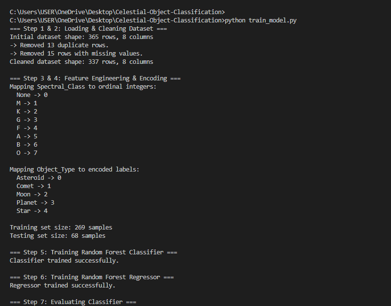
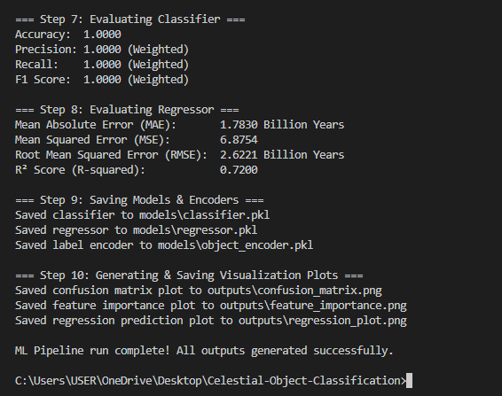
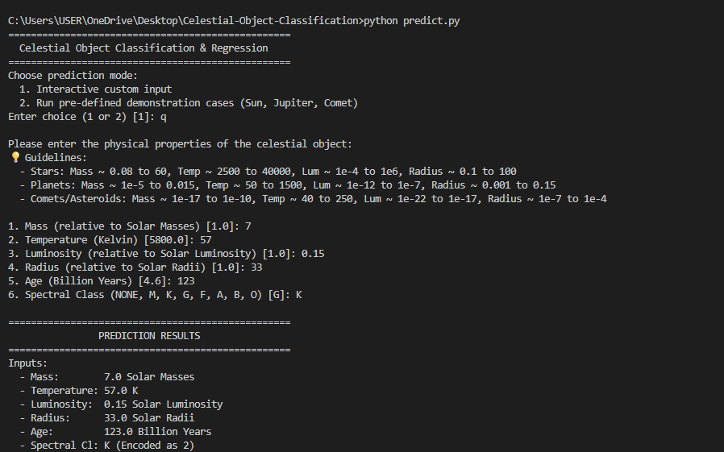
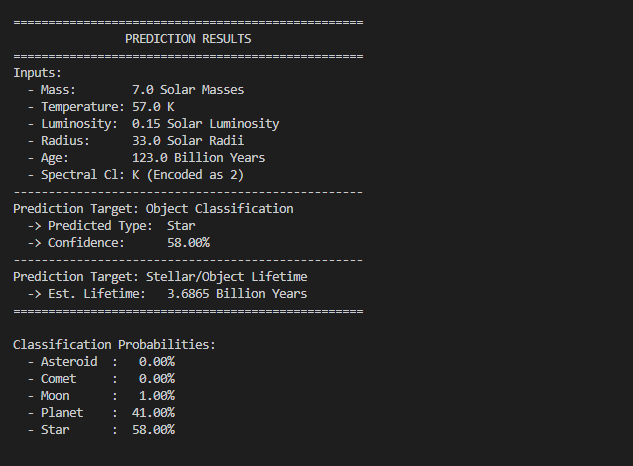
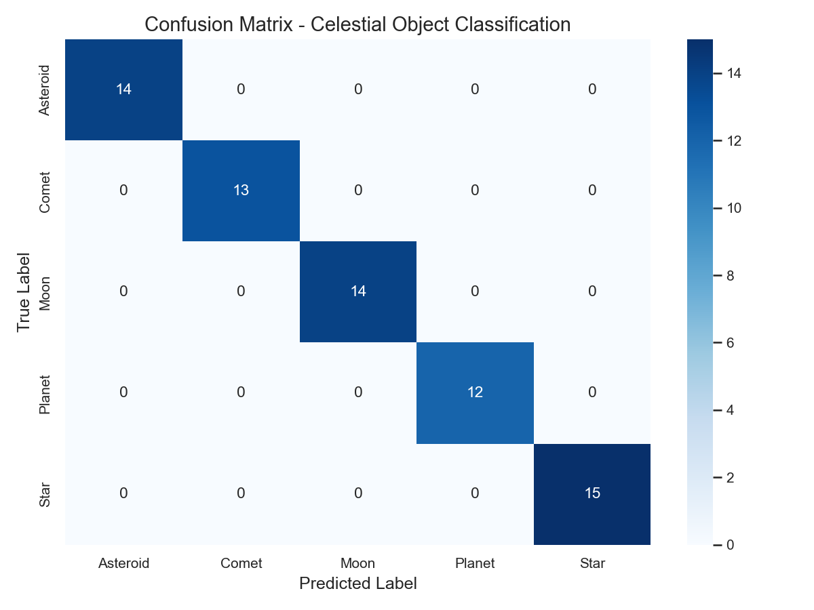
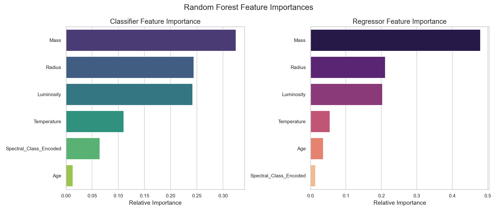
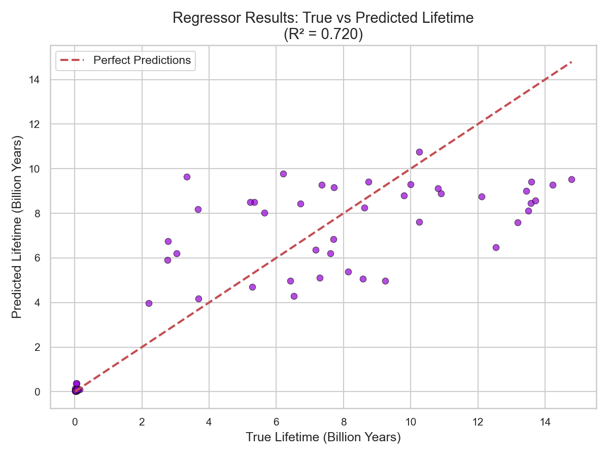

# 🌌 Celestial Object Classification & Lifetime Prediction


A complete Machine Learning project that classifies celestial objects into **Stars, Planets, Moons, Asteroids, and Comets** while predicting their estimated lifetime using Random Forest Classification and Regression models.

---

# ✨ Features

* 🌟 Celestial Object Classification
* ⏳ Lifetime Prediction
* 🧹 Data Cleaning & Preprocessing
* 🏷️ Label Encoding
* 📊 Feature Engineering
* 🌲 Random Forest Classifier
* 📈 Random Forest Regressor
* 📉 Model Evaluation
* 💾 Model Saving using Joblib
* 💻 Interactive Command-Line Prediction

---

# 🛠️ Technologies Used

* Python
* Pandas
* NumPy
* Scikit-learn
* Matplotlib
* Joblib

---

# 🚀 How to Run

```bash
pip install -r requirements.txt

python train_model.py

python predict.py
```

---

# 📸 Project Screenshots

## Model Training

### Training Output – Part 1



### Training Output – Part 2



---

## Interactive Prediction

### Prediction Output – Part 1



### Prediction Output – Part 2



---

## Model Evaluation

### Confusion Matrix



### Feature Importance



### Regression Prediction Plot



---

## 📂 Project Structure
